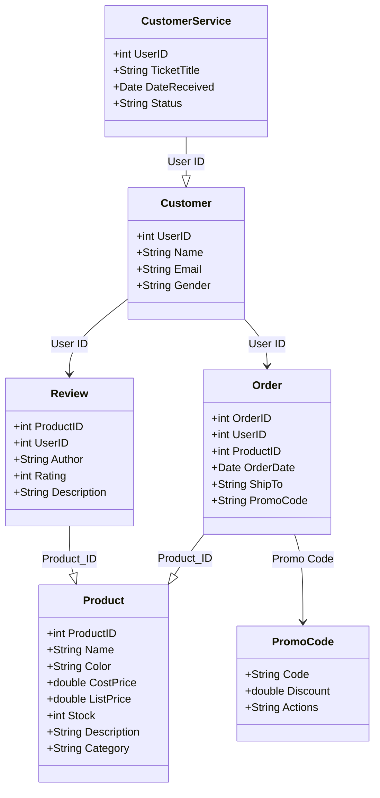
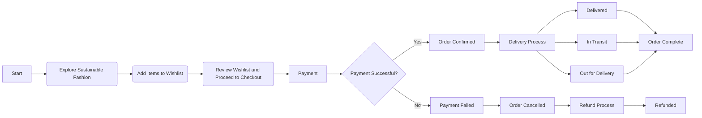
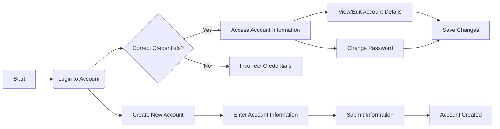

# EcoFashion - Transforming Fashion with *Sustainability* and **Innovation**

> Welcome to EcoFashion, where fashion meets sustainability in perfect harmony! Our team of dedicated experts is committed to providing you with an exceptional shopping experience while making a positive impact on the environment.

## Meet Our Team

Responsibilities | *Wei Heng* | *Ethan* | *Ching Yi*
--- | --- | --- | ---
Product Page | ✔️ | | 
Product Information | ✔️ | | 
Shopping Cart | ✔️ | | 
Order Tracking | ✔️ | | 
Refund | ✔️ | | 
Order Management | ✔️ | | 
Product Management | ✔️ | | 
Promo Code Management | ✔️ | | 
Review Management | ✔️ | | 
README.md | ✔️ | | 
base.html | ✔️ | | 
Sustainability Page | ✔️ | | 
Customer Service | | ✔️ | 
Resolving Tickets | | ✔️ | 
FAQ | | ✔️ | 
Chat | | ✔️ | 
Homepage | | | ✔️
Login & Sign Up | | | ✔️
Account Information & Password | | | ✔️
Wishlist | | | ✔️
Order Status & History | | | ✔️
Account Deletion | | | ✔️
Payment Methods | | | ✔️

> *Note: ✔️ represents the responsibilities handled by each team member.*

## Wei Heng - The Product Maestro

> **Wei Heng** is our product expert, ensuring that each item in our collection embodies the essence of sustainability. From the captivating *Product Page* to the detailed *Product Information*, **Wei Heng's** expertise shines through.

## Ethan - The Customer Whisperer

> **Ethan** is the heart and soul of our *Customer Service*. With a passion for people and a drive to deliver excellence, **Ethan** is your go-to ally for *resolving inquiries*, *managing Tickets*, and providing answers in our comprehensive *FAQ* section.

## Ching Yi - The Interface Virtuoso

> **Ching Yi** is the mastermind behind our user-friendly interface. From the captivating *Homepage* to seamless *Account Information and Password* management, **Ching Yi's** artistry makes navigation a breeze.

# Running EcoFashion Hub Website Locally

In this guide, we will walk you through the steps to run the EcoFashion Hub website on your local device. The website is hosted on GitHub, and you can run it using CodeSpaces or other methods.

<details>
  <summary>Prerequisites</summary>
Before you begin, ensure that you have the following installed on your device:

1. Python: Make sure you have Python installed. You can download the latest version from the official Python website (https://www.python.org/downloads/).

2. Git: Install Git on your machine if you haven't already. You can download it from the official Git website (https://git-scm.com/downloads).

## Cloning the Repository

1. Open your terminal or command prompt.

2. Navigate to the directory where you want to store the EcoFashion Hub website on your local device.

3. Clone the GitHub repository using the following command:

```
git clone https://github.com/your-username/EcoFashion-Hub.git
```

Replace `your-username` with your GitHub username.

## Setting up a Virtual Environment

1. Change into the cloned directory:

```
cd EcoFashion-Hub
```

2. Create a virtual environment:

```
python -m venv venv
```

3. Activate the virtual environment:

- On Windows:

```
venv\Scripts\activate
```

- On macOS and Linux:

```
source venv/bin/activate
```
</details>

## Running the Website

<details>

<summary><strong>Method 1: Using CodeSpaces</strong></summary>

If you are using GitHub CodeSpaces, follow these steps:

1. Open the `__init__.py` file in your CodeSpaces editor.

2. Click on the "Run" button at the top of the editor to start the development server.

3. Access the EcoFashion Hub website by clicking on the URL provided by the development server.

</details>

<details>

<summary><strong>Method 2: Using Python</strong></summary>

If you prefer to run the website using Python, follow these steps:

1. In your terminal or command prompt, make sure you are in the `EcoFashion-Hub` directory.

2. Run the following command to start the development server:

```
python __init__.py
```

3. Access the EcoFashion Hub website by visiting `http://localhost:5000` in your web browser.

</details>

## Stopping the Server

To stop the development server, press `Ctrl + C` in the terminal or command prompt where the server is running.

## UML


## Products

## Customer Service

```mermaid
flowchart LR;

    Start((Start))
    B(Customer Raises Inquiry)
    C((Resolution Required?))
    D[Resolve Inquiry]
    E[Escalate to Supervisor]
    F[Customer Satisfied]
    G[Issue Resolved]
    H[Supervisor Intervention]
    I[Investigation]
    J((Resolution Provided?))
    K[Proceed to Customer Feedback Collection]
    L[Identify Root Cause]
    M[Positive Feedback?]
    N[Negative Feedback?]
    O[Technical Issue]
    P[Communication Gap]
    Q[Process Gap]
    R[Share Positive Feedback with Customer]
    S((Compensation Required?))
    T[Apologize and Offer Discount]
    U[Issue Compensation]
    V[Seek Customer Preferences]
    W[Offer Discount]
    X[Provide Gift Voucher]
    Y[Product Replacement]
    Z[Refund Requested]
    End((End))
    
    Start -->|Raise Inquiry| B
    B -->|Resolution Required?| C
    C -->|Yes| D
    C -->|No| E
    D -->|Issue Resolved| G
    D -->|Customer Satisfied| F
    E -->|Supervisor Intervention| H
    H -->|Investigation| I
    I -->|Resolution Provided?| J
    J -->|Yes| K
    J -->|No| L
    K -->|Positive Feedback?| M
    K -->|Negative Feedback?| N
    L -->|Technical Issue| O
    L -->|Communication Gap| P
    L -->|Process Gap| Q
    M -->|Share Positive Feedback| R
    N -->|Compensation Required?| S
    N -->|Apologize and Offer Discount| T
    S -->|Issue Compensation| U
    S -->|Seek Customer Preferences| V
    U -->|Offer Discount| W
    U -->|Provide Gift Voucher| X
    V -->|Product Replacement| Y
    V -->|Refund Requested| Z
    R -->|End| End
    W -->|End| End
    X -->|End| End
    Y -->|End| End
    Z -->|End| End
    O -->|End| End
    P -->|End| End
    Q -->|End| End
    T -->|End| End

    AA[Automated Ticketing System]
    AA -->|Assign Ticket| B
    AA -->|Automated Responses| D
    AA -->|Escalate Complex Tickets| E
    
    BB[Knowledge Base]
    BB -->|Self-Help Articles| C
    BB -->|Frequently Asked Questions| C
    BB -->|Troubleshooting Guides| C
    BB -->|Agent Training| C
    
    CC[Omnichannel Support]
    CC -->|Phone Support| B
    CC -->|Email Support| B
    CC -->|Live Chat Support| B
    CC -->|Social Media Support| B
    
    DD[Customer Feedback Analysis]
    DD -->|Sentiment Analysis| M
    DD -->|Root Cause Analysis| L
    DD -->|Performance Metrics| R
    
    EE[Agent Performance Evaluation]
    EE -->|Quality Assurance| G
    EE -->|Customer Satisfaction Surveys| F
    EE -->|Response Time Monitoring| G
    
    FF[Customer Loyalty Programs]
    FF -->|Discount Offers| W
    FF -->|Exclusive Benefits| V
    FF -->|Reward Points System| X
    
    GG[Continuous Improvement]
    GG -->|Process Optimization| Q
    GG -->|Training and Development| C
    GG -->|Feedback Loop with Product Management| C
    
    End -->|Monitor and Review| DD
    End -->|Performance Evaluation| EE
    End -->|Customer Retention| FF
    End -->|Improvement Initiatives| GG

```

## Account Management

## Conclusion

Congratulations! You have successfully set up and run the EcoFashion Hub website on your local device. You can now explore the website and enjoy its eco-friendly fashion offerings. Happy shopping!
